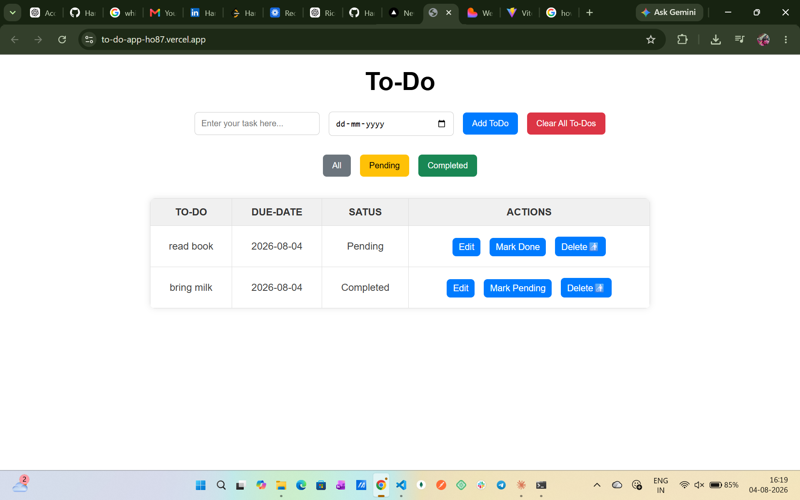

<div align="center">

# ✅ To-Do App

### A simple and responsive To-Do application built using Vanilla JavaScript that helps users manage daily tasks with local storage persistence.


[]()
[]()
[]()

## 🚀 Live Demo

- 🌐 **Live Demo:** https://to-do-app-ho87.vercel.app/
- 💻 **GitHub Repository:** https://github.com/HariPriya816141/To-Do-App


</div>

---

## 📖 Project Overview

This application allows users to create, edit, delete, filter, and manage daily tasks. All tasks are stored in the browser using Local Storage, ensuring they remain available even after refreshing the page.

---

## 🎯 Key Highlights

- Vanilla JavaScript Project
- CRUD Operations
- Local Storage Persistence
- Task Status Management
- Due Date Support
- Responsive Interface

---

## ✨ Features

- ➕ Add new tasks
- ✏️ Edit existing tasks
- 🗑️ Delete individual tasks
- 🧹 Clear all tasks
- ✅ Mark tasks as completed
- 🔄 Mark completed tasks as pending
- 📅 Due date support
- 🔍 Filter tasks by:
  - All
  - Pending
  - Completed
- 💾 Local Storage persistence
- 📱 Responsive design
- 🚨 Success and error alerts

---

## 🛠 Tech Stack

| Category | Technologies |
|----------|--------------|
| Frontend | HTML5, CSS3, JavaScript (ES6) |
| Storage | Local Storage |

---

## 📸 Application Screenshot

### ✅ Task Manager



Create, organize, update, and manage daily tasks with filtering and local storage support.

---

## ⚙ Installation

Clone the repository

```bash
git clone https://github.com/HariPriya816141/To-Do-App
```

Navigate into the project

```bash
cd To-Do-App
```

Run the application

Simply open

```text
index.html
```

in your browser.

---

## 📂 Folder Structure

```text
ToDoApp
│
├── index.html
├── style.css
├── script.js
└── screenshots
```

---

## 📚 Learning Outcomes

This project helped strengthen my understanding of:

- DOM Manipulation
- JavaScript Event Handling
- CRUD Operations
- Local Storage
- Array Methods
- Responsive CSS
- Dynamic UI Rendering

---

## 👩‍💻 Author

**Hari Priya**

GitHub:
https://github.com/HariPriya816141

LinkedIn:
https://www.linkedin.com/in/hari-priyaaa/